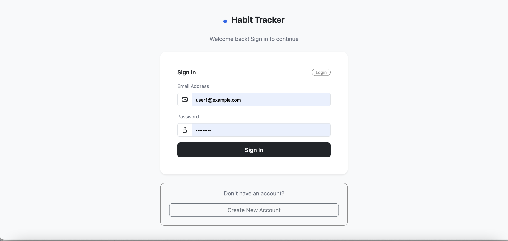
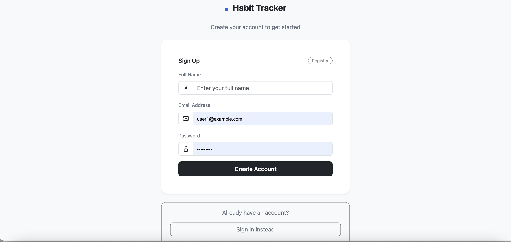
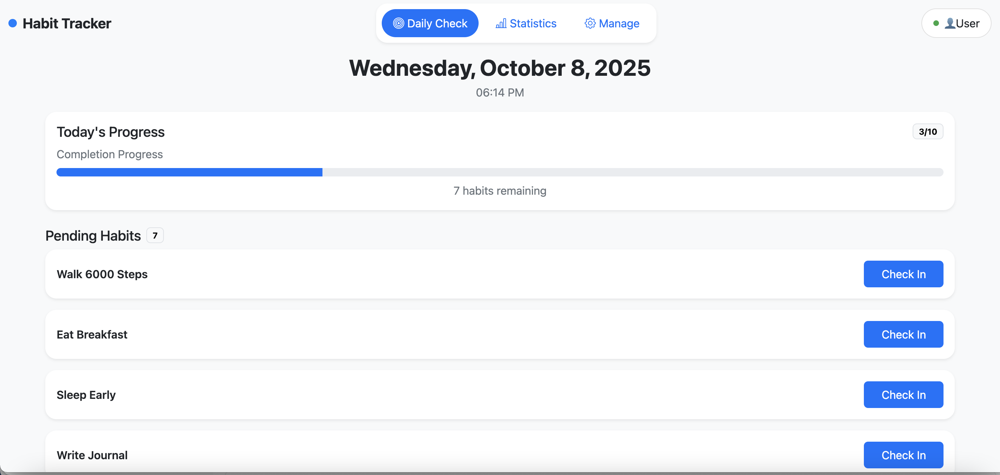
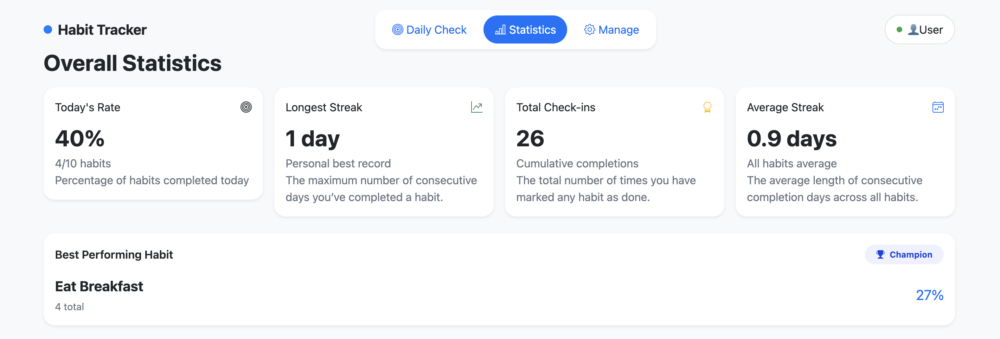
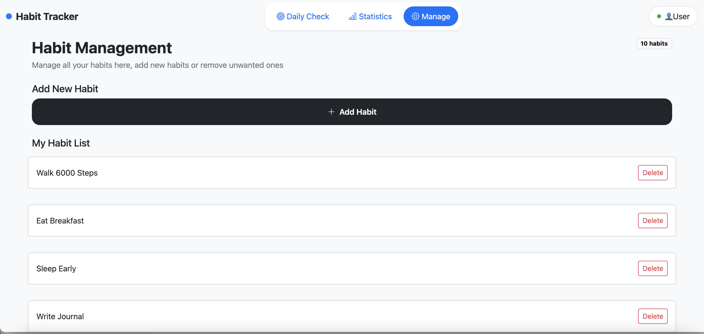
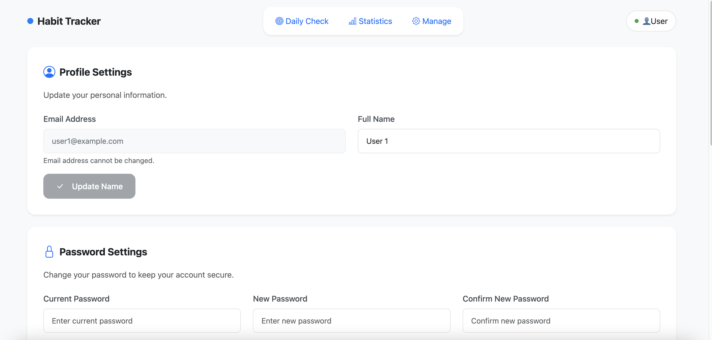
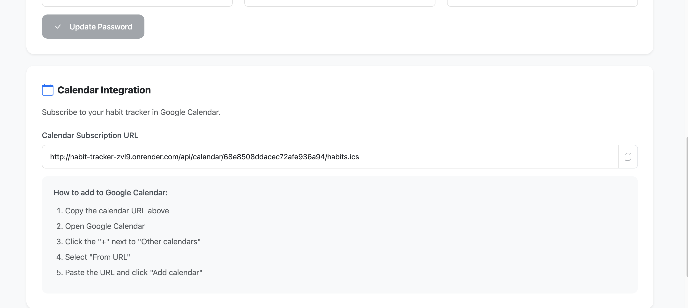
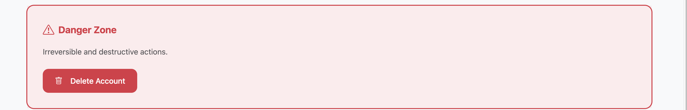

# 🚀 Habit Tracker Project

## 🎯 Project Objective
The Habit Tracker Web Application aims to help users build and maintain positive daily routines through a simple, data-driven interface.
It enables users to create habits, record daily progress, visualize long-term performance and set notification to calendar.
---

## 📸 Demo









---

## ⚙️ Tech Requirements
- HTML5, CSS3, JavaScript, Node, Express, Mongo
- Node.js >= 20
- ESLint + Prettier for code linting and formatting
- Git + GitHub for version control and hosting

---

## 📥 Installation & Usage
```bash
# Clone the repo
git clone https://github.com/zhuoyumiao/habit_tracker.git
cd habit_tracker

# If dependencies exist (optional)
npm install

# Create a .env file in the root directory:
PORT=3000
MONGODB_URI=<your Mongo connection string>
DB_NAME=<your db name>

# Open login.html directly in the browser
# or use a simple local server
npm start
```

---

## 👩‍💻 Author & Link
Author: Zhuoyu Miao & Chirag Suthar

---

## 📚 Reference to the Class
This project was created as part of the **CS5610 Web Development** course at Northeastern University. https://johnguerra.co/classes/webDevelopment_online_fall_2025/

---

## 📝 Resources:
Website Link: https://habit-tracker-zvl9.onrender.com/login.html  
Design document: [DesignDocument](/resources/DesignDocument.docx).    
Link of video demonstration: https://youtu.be/xumnV7JzdEA  
Demonstration slide: https://docs.google.com/presentation/d/1oFbkMyNtLxhO0xkZ4HitTSgF7sZm_OGixDz4ZZujn7s/edit?usp=sharing    

---
## 🤖 AI usage
Used ChatGPT to help create script that generates the random records into the database(seed.js). Used the GPT-5 and prompt "Create 2000 records that have users, habits and checkins".
